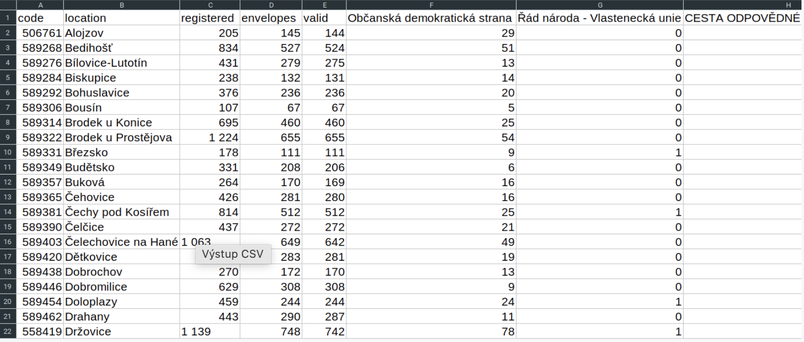

# Python projekt 

## Scraping voleb v roce 2021 a následná vizualizace v POWER BI

Odkaz na můj **Linkedln** [ZDE](https://www.linkedin.com/in/mat%C4%9Bj-frol%C3%ADk-183812230/) 

-------

### Postup projektu

1. Vytvoříte vlastní virtuální prostředí (speciálně pro tento úkol).
2. Do nově vytvořeného prostředí si přes IDE (nebo příkazový řádek) nainstalujeme potřebné knihovny třetích stran.
3. Vygenerujeme soubor requirements.txt, který obsahuje soupis všech knihoven a jejich verzí.
4. Výsledný soubor budeme spouštět pomocí 2 argumentů (ne pomocí funkce input). První argument obsahuje odkaz, který územní celek chcete scrapovat (př. územní celek Prostějov ), druhý argument obsahuje jméno výstupního souboru (př. vysledky_prostejov.csv)
Pokud uživatel nezadá oba argumenty (ať už nesprávné pořadí, nebo argument, který neobsahuje správný odkaz), program jej upozorní a nepokračuje.

Výstup bude obsahovat:
Ve výstupu (soubor .csv) každý řádek obsahuje informace pro konkrétní obec. Tedy podobu:

 - kód obce
 - název obce
 - voliči v seznamu
 - vydané obálky
 - platné hlasy
 - kandidující strany (co sloupec, to počet hlasů pro stranu pro všechny strany).

Příklad:

 

### Seznámení se s projektem
V následujících řádcích si ukážeme, jak nainstalovat potřebné knihovny ze souboru requirements.txt a jak spustit soubor i s grafickou ukázkou.